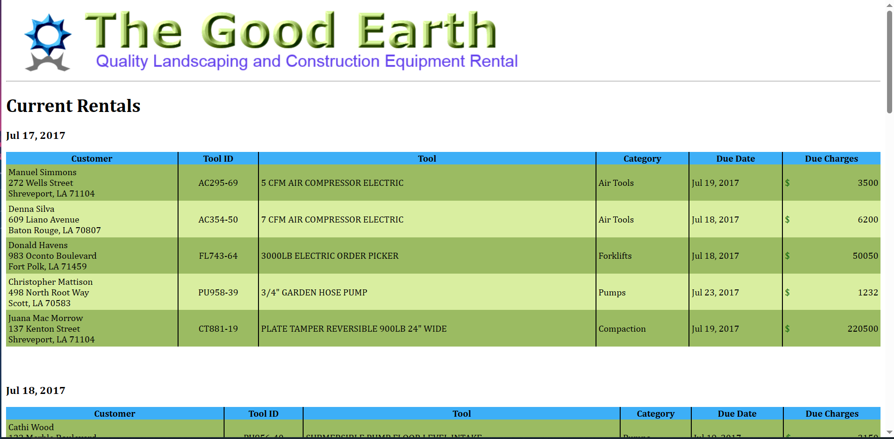

# XML Assignment 1
## COMP - 6000

- Three XML Vocabularies, `tgerentals.xml`, `tgecustomers.xml`, `tgetools.xml`
- A XML Schema document, `tgerentals.xsd` used in the XSLT file to validate `tgerentals.xml`
- A XSLT document `tgerentals.xsl` to style `tgerentals.xml` and query from others
- An output html document `tgerentals.html`

- An XSLT Processor uses the XSD and XSLT documents to validate, style and perform lookups from other XML documents as defined in the `tgerentals.xml`. They are not linked in any other way except for the XPath queries in the XSLT document.
- The processor produces the HTML document which is further styled with the `styles.css` file and logo .png file

